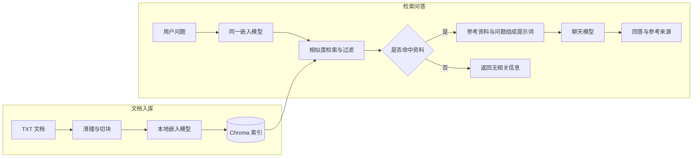

# 北京印刷学院智能问答助手

基于 RAG（检索增强生成）的校园文档问答项目，使用本地嵌入模型和 Chroma 检索资料，再通过兼容 OpenAI 格式的聊天接口生成带来源编号的回答。

项目面向 AI 应用开发学习与实践，包含从文档处理、向量入库到检索问答的完整流程。目前提供命令行单次问答，知识库包含 16 份校园文本资料，覆盖校史校情、本科与研究生招生、专业学科、教务选课、学习资源、学生支持、就业和国际交流等主题。

## 功能概览

- **文档处理**：读取 UTF-8 编码的 `.txt` 文件，清理空行并按句子切块。
- **本地向量检索**：使用 `BAAI/bge-small-zh-v1.5` 生成向量，通过 Chroma 持久化存储并执行余弦相似度检索。
- **基于资料回答**：将检索内容和问题组合成提示词，要求聊天模型按资料回答并标注来源编号。
- **来源展示**：输出本次检索的文件名及相似度，便于回查原文。
- **无命中处理**：没有资料通过相似度阈值时，直接返回“现有资料中没有相关信息”，跳过聊天接口调用。
- **索引更新**：重新入库时更新当前文档并清理多余旧块；无可用文本块时保留原索引。

## 技术栈

| 组件 | 技术 | 用途 |
| --- | --- | --- |
| 开发语言 | Python | 文档处理与问答流程 |
| 嵌入模型 | Sentence Transformers / BGE-small-zh-v1.5 | 在本地将文档和问题转为向量 |
| 向量数据库 | Chroma | 持久化索引与相似度检索 |
| 聊天接口 | OpenAI Python SDK | 调用兼容服务生成回答 |
| 环境配置 | python-dotenv | 加载本地模型服务配置 |
| 自动化测试 | unittest | 验证检索、索引更新和模型调用逻辑 |

## 工作流程



嵌入模型在本地运行，聊天模型由配置的服务提供。建立索引不会训练或微调模型。

## 快速开始

### 1. 准备环境

需要 Git、Python 3.10 或更新版本，以及可用的兼容 OpenAI Chat Completions 接口的服务。项目已在 Python 3.12.8 环境下通过自动化测试，建议使用 Python 3.12。

```bash
git clone https://github.com/luochen036/bigc_agent.git
cd bigc_agent
python -m venv venv
```

激活虚拟环境：

| 终端 | 命令 |
| --- | --- |
| Windows PowerShell | `.\venv\Scripts\Activate.ps1` |
| Windows CMD | `venv\Scripts\activate.bat` |
| macOS / Linux | `source venv/bin/activate` |

下文命令均在**仓库根目录**、已激活的虚拟环境中执行：

```bash
python -m pip install -r requirements.txt
```

### 2. 配置聊天服务

首次使用时，将 [bigc-agent/.env.example](bigc-agent/.env.example) 复制为同目录下的 `.env`。已有 `.env` 时跳过复制步骤，直接编辑配置。

Windows PowerShell：

```powershell
Copy-Item bigc-agent/.env.example bigc-agent/.env
```

macOS / Linux：

```bash
cp bigc-agent/.env.example bigc-agent/.env
```

在 `bigc-agent/.env` 中填写服务商提供的配置：

```dotenv
LLM_BASE_URL=https://your-provider.example/v1
LLM_API_KEY=your-api-key
LLM_MODEL=your-model-id
```

| 变量 | 说明 |
| --- | --- |
| `LLM_BASE_URL` | 接口基础地址，包含服务商要求的路径前缀，通常为 `/v1` |
| `LLM_API_KEY` | 服务商提供的 API 密钥 |
| `LLM_MODEL` | 服务商支持的准确模型标识 |

以上值仅为占位示例。已有系统环境变量优先于 `.env`，三个配置项均不能为空。`.env` 已被 Git 忽略。

### 3. 建立文档索引

```bash
python bigc-agent/src/build_index.py
```

默认读取 [bigc-agent/data/docs](bigc-agent/data/docs) 中的文本，并将索引保存至 `bigc-agent/storage/chroma/`。

嵌入模型优先从 `bigc-agent/models/BAAI--bge-small-zh-v1.5/snapshots/master/` 加载；该目录不存在时，Sentence Transformers 会尝试加载或下载 `BAAI/bge-small-zh-v1.5`。首次使用且无缓存时需要联网下载，模型权重与生成的索引均不包含在仓库中。此步骤不调用聊天接口。

### 4. 开始问答

```bash
python bigc-agent/src/agent.py
```

在“请输入问题：”提示后输入问题，例如：

```text
北京印刷学院有哪些特色专业？
```

程序输出回答、本次检索的来源文件及相似度，完成一次问答后退出。再次运行即可提出新问题，无需每次重建索引。

## 知识库与检索参数

知识库目录、资料年份和检索示例见 [知识库说明](bigc-agent/data/README.md)。2026-09-09 新增 13 份文档，均附官方来源及核验日期；原有 3 份文档保留原资料年份，校园生活中的学生访问通道更新为当前官网入口。年份限定的招生、选课和交流规则不能自动套用于其他年度。

将 UTF-8 编码的 `.txt` 文件放入 `bigc-agent/data/docs/`，程序只读取该目录的直接子文件。新增、修改或删除资料后，停止正在运行的问答程序，再执行 `build_index.py` 更新整套索引。当前不支持单文档增量导入。

| 参数 | 默认值 | 配置位置 |
| --- | --- | --- |
| 文本块目标长度 | 300 字符 | [splitter.py](bigc-agent/src/splitter.py) 的 `chunk_size` |
| 相邻块重叠长度 | 50 字符 | [splitter.py](bigc-agent/src/splitter.py) 的 `overlap` |
| 最大检索数量 | 3 | [retriever.py](bigc-agent/src/retriever.py) 的 `k` |
| 最低相似度 | 0.3 | [retriever.py](bigc-agent/src/retriever.py) 的 `min_score` |

切块按完整句子合并，长句可能超过目标长度。相似度使用 `1 - 余弦距离` 计算，分数不代表答案正确率；阈值需要根据实际知识库调整。修改切块参数后，应重新运行入库脚本；更换嵌入模型时，需使用与新模型匹配的全新索引。

## 项目结构

```text
bigc_agent/
├── README.md
├── requirements.txt          # 项目依赖
├── check_env.py              # 核心依赖检查
└── bigc-agent/
    ├── .env.example          # 聊天服务配置模板
    ├── requirements.txt      # 引用根目录依赖
    ├── data/docs/            # 知识库文本
    ├── src/
    │   ├── data_loader.py    # 文档加载与清理
    │   ├── splitter.py       # 文本切块
    │   ├── embedder.py       # 嵌入模型加载
    │   ├── store.py          # 向量持久化与索引更新
    │   ├── build_index.py    # 文档入库入口
    │   ├── retriever.py      # 检索与相似度过滤
    │   ├── languagemodel.py  # 聊天服务调用
    │   ├── agent.py          # 命令行问答入口
    │   └── test.py           # 手动查看检索结果
    └── tests/
        └── test_pipeline.py  # 自动化测试
```

## 检查与测试

检查核心依赖是否可导入：

```bash
python check_env.py
```

运行自动化测试：

```bash
python -m unittest discover -s bigc-agent/tests -p "test_*.py" -v
```

测试覆盖文档路径解析、切块边界、检索过滤、无命中处理、配置加载、模拟聊天响应和旧索引清理。测试不需要真实密钥，不下载嵌入模型，也不调用远程聊天接口。

已建立索引后，可以单独查看检索结果：

```bash
python bigc-agent/src/test.py
```

该脚本加载本地嵌入模型并打印来源、相似度和原文，不调用聊天接口；可在脚本中修改示例问题。

## 使用范围

当前版本用于学习和原型验证，提供单次命令行问答，尚未提供 Web 界面、多轮对话记忆或工具调用。

回答质量取决于资料内容、检索结果和聊天模型。来源编号由模型按提示生成，终端展示的是本次检索资料，应结合原文核对回答；招生政策等时效性信息请以学校最新官方发布为准。

调用聊天服务时，问题和命中的文本块会发送至配置的服务商，并可能产生接口费用。
